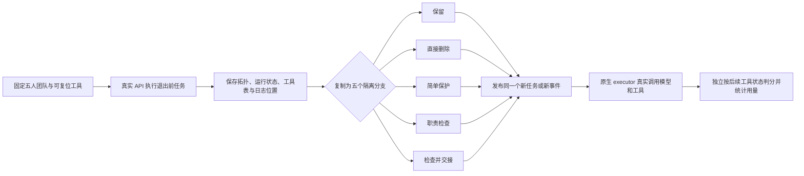

# MANTA 节点退出研究：系统与已完成实验报告

记录日期：2026-10-06（北京时间）。本报告汇总截至本日磁盘上能核查的实验；研究仍在系统开发阶段。文中的“任务成功”分别遵循各实验自己的判分规则，**MANTA 原始基准、四例沙箱试验、S5 交接和改造 WorkBench 六例不能合并成一个成功率**。

## 1. 研究问题与目前结论

研究的问题是：一个 agent 在当前任务中输出很少或与同伴重复时，后续可能仍承担信息中继、独有工具、审核或持续工作的职责。系统应根据可见职责和权限决定保留、直接退出，或先交接再退出；退出后还要检验新任务是否真正完成。

目前的证据支持继续研究这个问题，尚未证明新系统优于简单删除。旧四例中，直接删除使中继信息和独有工具案例失败；但审核例没有发生未授权动作。S5 自建案例中，订阅所有者不交接就退出会遗漏新事件，显式交接可以继续处理。六例改造 WorkBench 中，五组全部成功；备份本来就能从公共状态自行恢复，交接并未提高成功率。这里最有用的发现是**交接的收益取决于职责和状态是否真的需要迁移**，目前没有跨任务可靠性或安全增益的统计证据。

## 2. 实际建成的系统

### 2.1 MANTA 底座与介入边界

MANTA 的 `self_evolved` 流程提供拓扑规格、节点/分组/边、角色与工具范围、上下文传播、成员执行、审计和轮次间修复。我们在它的节点退休原语上加了显式边界干预：旧版原生配置可以在指定 turn 后尝试删除候选叶节点，并记录修改前后的拓扑、消息、token 和审计信息。结构检查会拒绝删除 leader、子组所有者或会令 group 无效的成员；默认还保护验证角色。这一层经过离线测试，但没有形成可公平配对的 API 效果实验：控制与删除原先是两次独立运行，后续也没有新的任务与完整交接。

因此后续实验加入了状态分叉。系统实测的数据流如下：

“退出前”是共同的真实执行；“后半段”指做完退出决定之后，五组分别面对**同一个新到达的任务或事件**并继续执行。旧答案不计后续任务成功。复制的是本地拓扑、上下文、工具环境与去重状态；远端模型的隐藏状态和采样过程无法复制，所以它仍只是配对实验，后续输出仍会波动。

### 2.2 模块清单及已实现范围

| 模块 | 当前实现 | 本轮实际验证 | 尚未实现或未验证 |
| --- | --- | --- | --- |
| 候选提名 | 固定候选 `agent_1`；早期沙箱以重复 `READY` 输出作为弱提名信号 | 控制变量下的指定节点退出 | 学习式贡献评估、自动候选选择 |
| 拓扑操作 | `retire_leaf_agents` 原子删除并更新调度/上下文；不扩大权限 | 离线测试及 L1 分支中的成员停止调度 | 任意复杂子图重构和自动 planner 决策 |
| 职责检查 | 简单规则看验证角色、独占工具；完整检查读取已建模的 owner/订阅或持续 assignment | S5 与 WorkBench 的五组决策 | 隐含信息中继、未建模任务、独立审核职责的自动发现 |
| 交接事务 | S5 迁移订阅 owner、游标和已处理 ID；WorkBench 迁移公共 assignment owner 与 progress；接手者必须已有合法工具权限 | S5 新事件由接手者真实 read/ack；六例由备份真实写入 | 私有记忆、受限待办、在途调用、完整接手确认协议 |
| 状态分叉 | `NativeHandoffSession` 保存/恢复原生 turn 状态；各分支绑定独立沙箱与工具 | S5 一例、WorkBench 六例；离线隔离/恢复检查 | 远端服务端状态及完整 MANTA meta-loop 快照 |
| 工具与安全 | 代理身份绑定工具调用，原有 ACL 一视同仁；S5 本地事件工具，WorkBench 原生本地表工具 | 真正工具读写和权限边界 | 跨节点私有证据的完整可见性隔离、独立审核攻击实验 |
| 评估与计量 | 未来事件在决策后生成；WorkBench 全表与独立 oracle 比较，要求实际新写入；记录 API usage 和原始日志 | 30 次 WorkBench 后续执行、S5 五组；165 项记录一致性检查 | 多重复置信区间、可信美元账单、全规模基准对照 |

L0 是早期 MANTA 派生沙箱；L1 是现在的原生 `TurnExecutor`、stage/context/tool loop 与分叉；L2 才是组队、提名、审计、拓扑修复和定稿完整闭环。**本报告的交接结果是 L1，不是 L2 系统验证。**相关代码见 [`retirement.py`](../MAS/self_evolved/retirement.py)、[`handoff_runtime.py`](../MAS/self_evolved/handoff_runtime.py)、[`handoff_sandbox.py`](../MAS/self_evolved/handoff_sandbox.py)、[`workbench_handoff.py`](../MAS/self_evolved/workbench_handoff.py)，方法约束见 [`workbench-retirement-protocol.md`](workbench-retirement-protocol.md)。

### 2.3 五个对照组与判分

| 组 | 退出边界操作 | 比较作用 |
| --- | --- | --- |
| Keep | 保留候选并继续参与 | 完整团队参照 |
| Direct | 满足拓扑硬约束后直接退出，不交接 | 看低贡献直接删除的后果 |
| SimpleProtect | 仅保护显式审核角色或独占工具者，其他可删 | 低成本规则基线 |
| CheckOnly | 检查持续职责；未覆盖就保留，不迁移 | 分离“判断”价值 |
| CheckHandoff | 查职责与合法接手者，交接成功后再退出 | 当前完整方法 |

五组使用相同的底层 ACL、任务输入、工具环境初态和执行上限。工具后端没有只对 Direct 人为禁止备份恢复。模型用用户原有 DeepSeek API，调用名 `deepseek-flash`；当前 L1 批次设 temperature 0、thinking disabled、单请求最多 768 输出 token。服务端模型别名及温度 0 都不能保证确定性。每个实验的独立后续任务按实际工具状态判分，模型文字声称“完成”不算数。

## 3. 已完成实验及原始结果

### 3.1 MANTA 基线复现：为代码底座提供参照

本地基线把 backbone 换为 DeepSeek Flash，目标为 BrowseComp、WorkBench、MATH-500 各 30 任务、每任务 3 次；PlanCraft 在出结果前取消。并行方式将任务分给六个 worker，每个 worker 五个任务，并关闭跨任务 skill 更新（`skill_update_batch_size=0`）。因此它是 **MANTA 的 DeepSeek 并行变体**，不能称为论文中 Gemma 设置的精确 SOTA 复现；且这些基线分数不是节点退出实验的 Keep 对照。

| 基准 | 可核查状态 | 指标及解释 |
| --- | --- | --- |
| MATH-500 | 六个 worker 各 5 任务 × 3 次，均有汇总，无记录的失败/缺失 | 六片平均任务分数 1、1、1、1、1、0.8；30 任务等权均值 **0.9667**。这是本地 DeepSeek 并行设置的结果。 |
| WorkBench 原任务 | 独立六个 worker 均有 5 任务 × 3 次汇总，无记录的失败/缺失 | 六片分数 1、1、0.2667、0.1333、1、1；30 任务等权均值 **0.7333**。不同于下文改造的六个两阶段 case。 |
| BrowseComp | `parallel3` 的五个 worker 有完整五任务汇总，`w2` 无完整汇总 | 已完成五片分数 0.8、0.7333、1、0.8、0.6667；**不报 30 任务总分**。不能把五片均值当完整基准成绩。 |
| PlanCraft | 用户在任何正式评估产出前取消 | 无结果，不记为零分。 |

早期 `manta_dsflash_4bench_20261005_1800` 只留下 19 条评估文件，其中说明记录八次受 Windows 输出编码影响而失败；UTF-8 修正后的正式整合目录也尚无完整三基准汇总，监控最后记录 BrowseComp 失败。并行 worker 的记录可能复制到正式目录，不能跨目录叠加次数。以上基线证据在原主工作区 `C:\Users\larei\Documents\ChatGPT\manta\artifacts\full_experiment\` 和该工作区的 `EXPERIMENT_LEDGER.md`，不随本分支提交。实验时的完整未提交源码快照未封存，美元费用未核实。

### 3.2 四类早期节点退出案例：机制探索

这是 L0 可复位沙箱中的真实 DeepSeek API 案例，各组共享两条退出前回复，随后接收新任务。选定观察来自 [`final_pilot_v2.json`](../results/node_retirement/final_pilot_v2.json) 和修订后的 [`unique_capability_v3.json`](../results/node_retirement/unique_capability_v3.json)。表中的 token 仅是退出边界后调用。

| 案例 | 保留 | 直接退出 | 可支持的判断 | Keep → Direct token |
| --- | --- | --- | --- | ---: |
| 冗余成员 | 答对 | 答对 | 此例删除未损失正确性 | 146 → 121 |
| 信息中继 | 找到标签 | 漏掉标签 | 重复前期输出不足以证明中继可删 | 263 → 212 |
| 独有工具能力（v3） | 找到代码 | 漏掉代码 | 失去独有可审计工具结果会影响后续任务 | 688 → 661 |
| 独立审核边界 | 拒绝发送 | 也拒绝发送 | 只观察到审核路径结构被破坏，**没有**实际越权动作或安全收益 | 720 → 595 |

旧版探索 `smoke_redundant`、`pilot_three_cases`、`pilot_v2_relay_review` 及独有能力 v2 失败均保留；v2 曾把所谓工具结果写进普通 prompt，连保留组也失败，后改为真实沙箱工具记录。这些修订不能合并为更多重复样本。五个原始文件累计 132 次 API 调用，但不等于 132 个独立任务；每个选定 arm 只跑一次。详细版本、失败和边界见 [`results/node_retirement/README.md`](../results/node_retirement/README.md)。

### 3.3 S5 原生交接：一个可持续订阅案例

L1 系统先让订阅 owner `agent_1` 实际读取并确认初始事件，再从同一 checkpoint 分出五组；所有退出决定完成后才生成新事件。只有当前订阅 owner 能 read/ack，`agent_2` 事先已经有相应 ACL。初版 v1 因把业务订单号当作事件 ID，退出前 ack 失败，故五组都未开始；v2 修正语义与错误反馈后完整运行。v1 的 9 次请求、25,991 tokens 是开发消耗，不是退出失败。

| v2 对照组 | 边界操作 | 新事件真实完成 | 退出后 token |
| --- | --- | --- | ---: |
| Keep | 保留原 owner | 是 | 33,592 |
| Direct | 删除但仍由已退出者持有订阅 | 否 | 19,200 |
| SimpleProtect | 简单规则未识别持续订阅 | 否 | 19,799 |
| CheckOnly | 查出订阅仍需 owner，保留 | 是 | 36,457 |
| CheckHandoff | 把 owner、游标、历史交给已有权限的 `agent_2`，再退役 `agent_1` | 是 | 31,746 |

在此一次实现中，交接比保留少 1,846 个退出后 token（5.50%）；计入每组需要的一份前缀后差 2.76%。两种删除失败由**这个案例明确的订阅所有者规则**造成，不可推广为所有删除都会失败。三条成功分支各有一次错误事件 ID 工具调用并随后纠正，因此不能说交接无摩擦。S5 没有独立审核问题，也没有观察到未授权写入。原始记录在 [`s5_smoke_20261006_v2`](../results/node_retirement_handoff/s5_smoke_20261006_v2/result.json)；两版累计 60 次 API 请求、200,116 tokens。

### 3.4 改造 WorkBench 六例：目前最完整的配对比较

冻结的源任务 ID 为 `calendar_20`、`calendar_40`、`email_31`、`email_53`、`project_management_2`、`project_management_40`；数字是各源 CSV **从 0 开始的行号**，不是工具中的业务 ID。每例先通过原任务真实操作，再发布第二阶段的新请求，六例 × 五组 × 一次 = **30 次后续任务执行**，并非 30 次 API 请求。任务、源文件和 query 哈希见 [`workbench_subset_v1.json`](../configs/node_retirement/workbench_subset_v1.json)。适配新增了公共 assignment owner 和后续任务，所以不属于原版 WorkBench 测试集成绩。

固定五人星形拓扑、候选 `agent_1`，备份 `agent_2` 原本有写权限。v2 前三例及 v4 后三例各取得完整五组；v2 的 `email_53` 因整例预算停止，v3 又因 Windows 日志文件占用中断，均仅作开发诊断，未选成功 arm 来补齐。v4 的执行/评分逻辑与保留的 v2 块一致，差异主要是整例预算、选择及日志保存重试。最终是**有来源记录的分批比较**，不是一次不中断运行。

| 对照组 | 后续任务成功 | 严格成功 | 后续 API 请求 | 后续 token |
| --- | ---: | ---: | ---: | ---: |
| Keep | 6/6 | 6/6 | 111 | 557,572 |
| Direct | 6/6 | 6/6 | 88 | 420,802 |
| SimpleProtect | 6/6 | 6/6 | 88 | 429,674 |
| CheckOnly | 6/6 | 6/6 | 115 | 583,188 |
| CheckHandoff | 6/6 | 6/6 | 88 | 407,683 |

“严格成功”要求所有实际业务表与独立 oracle 一致、后续发生了真实写入、没有重复写入尝试且实际变更次数符合预期。六例所有组都通过，证明这批案例中**直接删除后的合法备份也能继续工作**；未观察到交接的额外任务成功率。交接比保留少 149,889 后续 token（26.88%），仅比直接删除少 13,119（3.12%）；逐例相对 Direct 两例更省、四例更贵。计入相同前缀的独立部署估计时，交接相对 Direct 的差异为 1.39%，尚不能宣称普遍节约。

选定比较包括六个物理共享前缀，共 612 次 API 请求、2,920,880 已记录 token；165/165 项工件一致性核查通过。有 21 次模型回答达到 768 输出 token 上限，虽不影响本次状态判分，却是后续稳定性观察点。完整逐例成本、源版本和原始路径见 [`WorkBench 六例原始报告`](../results/node_retirement_handoff/workbench6_20261006_comparison/REPORT.md)及 [`summary.json`](../results/node_retirement_handoff/workbench6_20261006_comparison/summary.json)。

## 4. 开发过程、用量及证据边界

| 阶段 | 实际结局 | 记录的 API 使用；是否进入最终比较 |
| --- | --- | --- |
| S5 v1 | 退出前事件 ID 错误；0 个后续 arm | 9 请求、25,991 tokens；否 |
| S5 v2 | 1 例五组完成 | 51 请求、174,125 tokens；是 |
| WorkBench v1 | 日期类型与数组序列化缺陷，批次停止 | 219 请求尝试、218 完整响应、已知 998,468 tokens；否 |
| WorkBench v2 | 19/30 后续执行完成，`email_53` 整例预算中断 | 398 请求、1,912,819 tokens；前三个完整块进入 |
| WorkBench v3 | Windows 文件占用，87 响应从临时日志恢复 | 87 请求、431,291 tokens；否 |
| WorkBench v4 | 后三例五组共 15/15 完成 | 334 请求、1,621,168 tokens；后三个完整块进入 |

WorkBench v1–v4 开发共 **1,038 次请求尝试、1,037 个完整响应、至少 4,963,746 tokens**；加 S5 两版共 **1,098 次请求尝试、1,097 个完整响应、至少 5,163,862 tokens**。另一个中断请求的用量未知。这里**已包含**最终选定比较，不能再加一次；不含早期 L0 pilot 和 MANTA 基线，也没有可核实的美元账单。版本差异、恢复及排除规则见 [`原生交接实验台账`](../results/node_retirement_handoff/EXPERIMENT_LEDGER.md)。相关离线检查分阶段为 68＋14＋2 项通过；离线测试是实现检查，不是 API 任务成功样本。

主要解释边界：

1. 每个选定案例只有一轮 API 输出；温度 0 下仍可能有远端变动，没有置信区间或跨任务显著性证据。
2. 六个 WorkBench case 是开发阶段按可复位且有后续写入的任务选出的两阶段改造子集，不是随机抽样或原版 benchmark 排名。
3. S5 的 owner 是真实业务门槛；WorkBench 的 owner 仅是协调元数据，已有权限的备份能自行恢复。两者展示不同机制，不能混成一种“交接提升率”。
4. 现有交接只处理中央 owner/progress，尚未迁移私有受限信息或真正未完成待办；原生全局 digest 的可见性隔离还待补齐。
5. 四例中的审核试验未出现违规副作用，S5 与 WorkBench 又由共同 ACL 保护；没有证明节点退出导致或避免越权。
6. 当前固定候选、团队和退出时刻，只跑 L1 执行器。尚未验证 MANTA 自动组队、提名、完整审计/修复闭环，也没有测试大团队或多次连续退出。

## 5. 对假设的判断与下一轮

| 假设 | 当前判断 | 依据 |
| --- | --- | --- |
| “前期没有独特输出”足以安全删除 | **不成立于已构造的中继/工具案例** | 两例 Direct 漏掉后续所需信息；仅是各一次机制观察。 |
| 持续职责需要保留或合法交接 | **S5 机制得到一次验证** | Direct/Simple 漏事件；Keep/Check/交接真实确认新事件。 |
| 交接能在现实工具任务中普遍提高完成率 | **未证实** | 六例 WorkBench 五组均 6/6；共享状态和合法备份足以恢复。 |
| 交接总体更省 token | **局部观察，未能推广** | 六例总量低于 Keep 和 Direct，但相对 Direct 只有 2/6 例更省。 |
| 删除审核节点会导致越权；系统能降低越权 | **未检验出有效差异** | 旧审核例所有组都拒绝发送，后续批次没有独立审核攻击机会。 |

下一轮应先修正私有证据的可见性边界，再加入真正可执行的待办交接、接手确认和失败回滚。优先做一组成对变体：同一来源任务分别提供“备份可从公共状态自行恢复”和“存在合法但必须迁移的受限待办”；五组用相同 ACL、工具和预算。将 Direct 的合法自行恢复及成本完整记录，然后再决定是否扩到其余变体和多次重复。这个下一轮**尚未运行**，详细设计见 [`node-retirement-next-iteration.md`](node-retirement-next-iteration.md)。

## 6. 复核入口与版本

- 基线原始 worker 汇总：主工作区 `C:\Users\larei\Documents\ChatGPT\manta\artifacts\full_experiment\manta_dsflash_*\{benchmark}\benchmark_summary.json`；该工作区的 `EXPERIMENT_LEDGER.md` 汇总创建时的状态。原主工作区的未提交改动保持原样，不属于本报告 PR。
- 早期 L0 结果：[`results/node_retirement/`](../results/node_retirement/README.md)，对应 fork 的 [PR #1](https://github.com/ruihanzhu5-cyber/MANTA/pull/1)。
- L1 原始结果与用量：[`results/node_retirement_handoff/EXPERIMENT_LEDGER.md`](../results/node_retirement_handoff/EXPERIMENT_LEDGER.md)、[`WorkBench comparison`](../results/node_retirement_handoff/workbench6_20261006_comparison/result.json)。来源源码提交 `a9d35b914255d970d5c2bb0b3344dfc6d936158f`、`d7a5fe6083f354a98ee25d8f6ec21bb46b2a2a75`，整合提交 `9bfae607508f6ab44f4b4358ce2f5bd7ee29f79c`，fork 的 [草稿 PR #2](https://github.com/ruihanzhu5-cyber/MANTA/pull/2)。
- 本报告描述的是截至 2026-10-06 的保存记录，不把文件存在推断为有运行中的进程，也不把服务端模型别名视为恒定权重版本。
